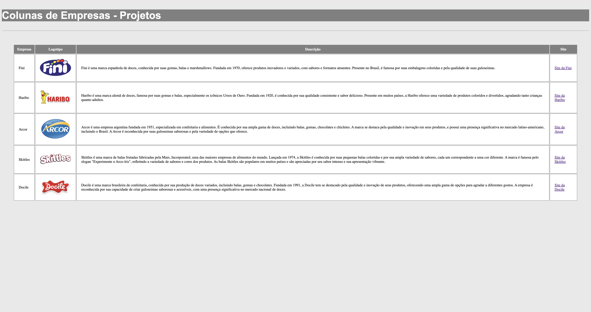

# Table - Coluna de empresas

---

## Sobre
Site utilizando Table, utilizando empresas.
O objetivo do projeto foi a autonomia de pesquisar como se fazia uma tabela e colocar em prática os conhecimentos adquiridos sobre as linguagens de marcacao, HTML, CSS e Markdown, realizadas no curso técnico de desenvolvimento de sistemas do [SENAI Jandira](https://sp.senai.br/unidade/jandira/)

---

## Tecnologias Utilizadas
- HTML
- CSS
- Markdown
- Git 

---

## Autora

- [Thayná de Oliveira](https://www.linkedin.com/in/thayn%C3%A1-freire-863696297/)